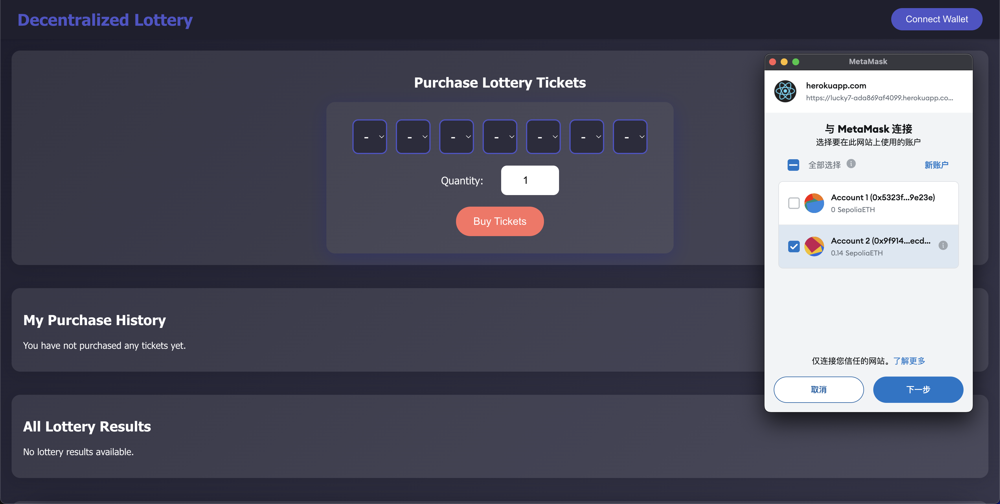

# Implementation of a Blockchain Application 

#### 4. Blockchain Application Implementation
- **Smart Contract Development**
    - The smart contract for the Lottery application is written in Solidity and includes the following key components:
        - **Ticket**: A struct representing a lottery ticket with buyer address, ticket number, and purchase time.
        - **Winner**: A struct representing a winner with address, winning number, prize, and amount.
        - **Draw**: A struct representing a lottery draw with draw ID, winning number, draw time, and an array of winners.
        - **Functions**: Functions for buying tickets, drawing the lottery, distributing prizes, pausing/unpausing the contract, and withdrawing funds.
    - Below is the code for the smart contract:
    ```solidity
    // SPDX-License-Identifier: MIT
    pragma solidity ^0.8.0;

    contract Lottery {
        struct Ticket {
            address buyer;
            string number;
            uint256 purchaseTime; 
        }

        struct Winner {
            address winnerAddress;
            string winningNumber;
            string prize;
            uint256 amount;
        }

        struct Draw {
            uint256 drawId;
            string winningNumber;
            uint256 drawTime;
            Winner[] winners;
        }

        Ticket[] public tickets;
        mapping(address => Ticket[]) public userTickets;

        Draw[] public draws;

        uint256 public ticketPrice = 0.001 ether;
        uint256 public lastDrawTime;
        uint256 public drawInterval = 3 days;

        uint256 public firstPrizeAmount;
        uint256 public immutable secondPrizeAmount = 2 ether;
        uint256 public immutable thirdPrizeAmount = 1 ether;
        uint256 public immutable fourthPrizeAmount = 0.5 ether;

        address public owner;
        bool public paused = false;

        uint256 private drawCounter = 0;

        event TicketPurchased(address indexed buyer, string number, uint256 quantity, uint256 timestamp);
        event LotteryDraw(uint256 drawId, uint256 drawTime, string winningNumber, uint256 totalWinners);
        event PrizeDistributed(address indexed winner, string number, string prize, uint256 amount, uint256 drawId);
        event FundsWithdrawn(address indexed to, uint256 amount);
        event Paused();
        event Unpaused();

        modifier onlyOwner() {
            require(msg.sender == owner, "Caller is not the owner");
            _;
        }

        modifier whenNotPaused() {
            require(!paused, "Contract is paused");
            _;
        }

        constructor() payable {
            owner = msg.sender;
            lastDrawTime = block.timestamp;
            firstPrizeAmount = 0;
        }

        function getBalance() public view returns (uint) {
            return address(this).balance;
        }

        function pause() external onlyOwner {
            paused = true;
            emit Paused();
        }

        function unpause() external onlyOwner {
            paused = false;
            emit Unpaused();
        }

        function buyTicket(string memory _number, uint256 _quantity) public payable whenNotPaused{
            require(bytes(_number).length == 7, "Ticket number must be 7 digits");
            for (uint256 i = 0; i < 7; i++) {
                require(
                    bytes(_number)[i] >= '0' && bytes(_number)[i] <= '9',
                    "Ticket number must be numeric"
                );
            }
            require(msg.value == ticketPrice * _quantity, "Incorrect ETH amount");

            uint256 totalAmount = msg.value;
            uint256 prizePoolContribution = totalAmount / 2;

            firstPrizeAmount += prizePoolContribution;

            uint256 currentTime = block.timestamp;

            for (uint256 i = 0; i < _quantity; i++) {
                Ticket memory newTicket = Ticket(msg.sender, _number, currentTime);
                tickets.push(newTicket);
                userTickets[msg.sender].push(newTicket);
            }

            emit TicketPurchased(msg.sender, _number, _quantity, currentTime);
        }

        function drawLottery() public onlyOwner whenNotPaused{
            require(block.timestamp >= lastDrawTime + drawInterval, "It's not time to draw yet");
            require(tickets.length > 0, "No tickets purchased");

            string memory winningNumber = generateRandomNumber();
            uint256 currentTime = block.timestamp;

            Draw storage newDraw = draws.push();
            newDraw.drawId = ++drawCounter;
            newDraw.winningNumber = winningNumber;
            newDraw.drawTime = currentTime;

            uint256 firstPrizeWinnersCount = 0;
            uint256[] memory winningIndexes = new uint256[](tickets.length);
            uint256 winningIndexCount = 0;

            for (uint256 i = 0; i < tickets.length; i++) {
                uint256 difference = compareNumbers(tickets[i].number, winningNumber);

                if (difference == 0) {
                    firstPrizeWinnersCount++;
                    winningIndexes[winningIndexCount] = i;
                    winningIndexCount++;
                } else if (difference == 1) {
                    distributePrize(tickets[i].buyer, tickets[i].number, "Second Prize", secondPrizeAmount, newDraw.drawId, newDraw.winners);
                } else if (difference == 2) {
                    distributePrize(tickets[i].buyer, tickets[i].number, "Third Prize", thirdPrizeAmount, newDraw.drawId, newDraw.winners);
                } else if (difference == 3) {
                    distributePrize(tickets[i].buyer, tickets[i].number, "Fourth Prize", fourthPrizeAmount, newDraw.drawId, newDraw.winners);
                }
            }

            if (firstPrizeWinnersCount > 0) {
                uint256 prizePerWinner = firstPrizeAmount / firstPrizeWinnersCount;
                uint256 remainder = firstPrizeAmount % firstPrizeWinnersCount;
                for (uint256 j = 0; j < winningIndexCount; j++) {
                    address winnerAddress = tickets[winningIndexes[j]].buyer;
                    uint256 prize = prizePerWinner;
                    distributePrize(winnerAddress, tickets[winningIndexes[j]].number, "First Prize", prize, newDraw.drawId, newDraw.winners);
                }
                firstPrizeAmount = remainder;
            }

            delete tickets;
            lastDrawTime = currentTime;

            emit LotteryDraw(newDraw.drawId, newDraw.drawTime, winningNumber, newDraw.winners.length);
        }

        function distributePrize(
            address _winner,
            string memory _number,
            string memory _prize,
            uint256 _amount,
            uint256 _drawId,
            Winner[] storage _drawWinners
        ) internal {
            (bool success, ) = payable(_winner).call{value: _amount}("");
            require(success, "Transfer failed");

            Winner memory newWinner = Winner(_winner, _number, _prize, _amount);
            _drawWinners.push(newWinner);

            emit PrizeDistributed(_winner, _number, _prize, _amount, _drawId);
        }

        function withdrawFunds(uint256 _amount) external onlyOwner {
            require(_amount <= address(this).balance, "Insufficient balance");
            (bool success, ) = payable(owner).call{value: _amount}("");
            require(success, "Withdrawal failed");
            emit FundsWithdrawn(owner, _amount);
        }

        function compareNumbers(string memory _ticketNumber, string memory _winningNumber) internal pure returns (uint256) {
            uint256 differenceCount = 0;
            for (uint256 i = 0; i < 7; i++) {
                if (bytes(_ticketNumber)[i] != bytes(_winningNumber)[i]) {
                    differenceCount++;
                }
            }
            return differenceCount;
        }

        function generateRandomNumber() internal view returns (string memory) {
            uint256 randomNum = uint256(keccak256(abi.encodePacked(block.timestamp, block.prevrandao))) % 10000000; // 生成 0 到 9999999 的随机数
            return padNumber(randomNum);
        }

        function padNumber(uint256 _number) internal pure returns (string memory) {
            require(_number < 10000000, "Number must be less than 10000000");
            
            bytes memory numberBytes = new bytes(7);
            for (uint256 i = 0; i < 7; i++) {
                numberBytes[6 - i] = bytes1(uint8(48 + (_number % 10))); // 48 是字符 '0' 的 ASCII 码
                _number /= 10;
            }
            return string(numberBytes);
        }

        function getDraws() public view returns (Draw[] memory) {
            return draws;
        }

        function getUserTickets(address _user) public view returns (Ticket[] memory) {
            return userTickets[_user];
        }

        // Fallback functions to accept Ether
        receive() external payable {}
        fallback() external payable {}
    }
    ```
    - The main functions and operational processes of the smart contract include:
        - **buyTicket**: Allows users to purchase lottery tickets by providing a 7-digit number and the quantity of tickets.
        - **drawLottery**: Conducts the lottery draw, determines the winning number, and distributes prizes to the winners.
        - **distributePrize**: Distributes the prize to the winners based on the number of matching digits.
        - **pause** and **unpause**: Allows the owner to pause and unpause the contract.
        - **withdrawFunds**: Allows the owner to withdraw funds from the contract.

- **Front-End Development**
  - 
    *Figure: User Interface Design.*
  - 
    *Figure: Wallet Integration.*
  - 
    *Figure: Lottery Ticket Purchase 1.*
  - 
    *Figure: Lottery Ticket Purchase 2.*
  - 
    *Figure: Lottery Ticket Purchase 3.*
  - 
    *Figure: Lottery Ticket Purchase 4.*